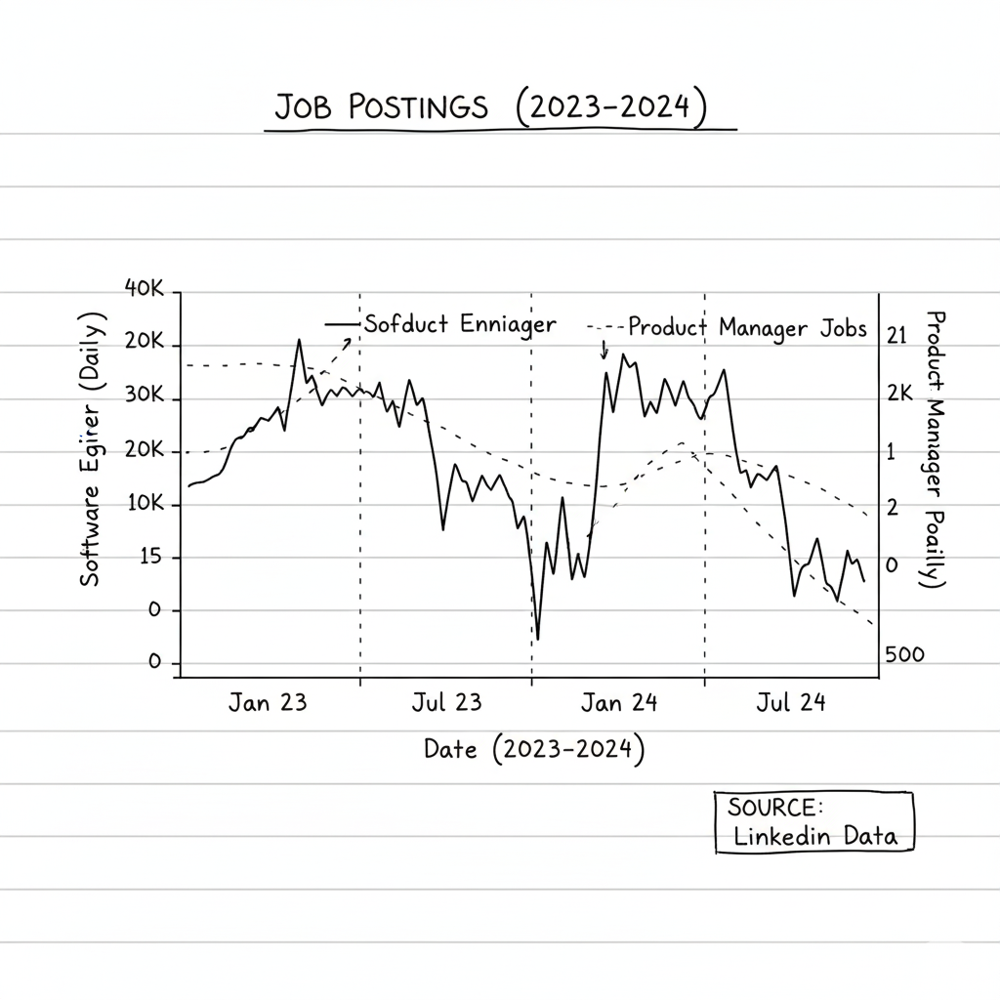
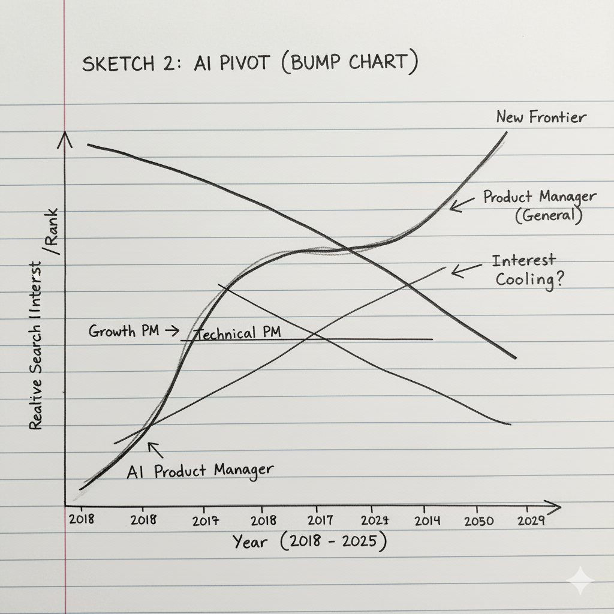

| [home page](https://naynikaw.github.io/nayn-viz/) | [data viz examples](dataviz-examples) | [critique by design](critique-by-design) | [final project I](final-project-part-one) | [final project II](final-project-part-two) | [final project III](final-project-part-three) |

# Outline

Over the last decade, "Product Manager" shifted from a niche role you stumbled into to a coveted status symbol you study for. This project maps the **cultural explosion** of the Product Management career path.

Instead of merely analyzing job postings, I will analyze the *gap between the dream and the reality*. I will visualize the rise of the "PM Influencer" economy and the "AI Pivot" using search and community data, and then contrast that against the hard truth of **124,000+ actual job postings from 2023–2024**. The story tracks how the role became "The MBA of the 2020s," how an industry emerged to sell the dream, and whether the recent pivot to "AI Product Management" is a genuine market shift or just a survival tactic.

I will structure the narrative using a three-act "Rise, Saturation, and Reality" arc:

* **Act I: The Discovery:** Visualizing the moment "Product Manager" entered the mainstream consciousness. I will compare search interest for PMs against established roles like Software Engineering to show when the "hype rocket" took off.
* **Act II: The Education Economy:** The rise of the "Gatekeepers." I will visualize the correlation between community growth (Reddit) and the search volume for major prep platforms, showing how the *business* of teaching PMs grew faster than the role itself.
* **Act III: The AI Pivot & The Reality Check :** As general interest plateaus, the field is fracturing. I will visualize the sudden search spike in "AI Product Manager" and compare it against **real LinkedIn job data**. By analyzing skills and salaries in 2023–2024 postings, I will determine if the "AI Pivot" is a real hiring trend with higher pay, or just a rebrand in a cooling market.

## Initial sketches

Below are the initial concept sketches for the visualization of the "Hype Rocket - Job Trends PM vs SWE" (general interest), the "AI Pivot" (specialization ranking), and the "Education Ecosystem" (timeline of services).

 | Search interest data (2010–Present) comparing "Product Manager" vs. "Software Engineer." Also includes niche keyword data for "AI Product Manager" vs. "Technical Product Manager." |
| The Community (Reddit Stats) | [subredditstats.com](https://subredditstats.com/) | Daily subscriber growth data for `r/ProductManagement`. Used to visualize "hockey stick" growth and compare against `r/MBA`. |
| The Interview Economy (Brand Search) | [trends.google.com](https://trends.google.com/) | Search volume indices for major industry gatekeepers to proxy the "PM Education" industry: "Product School", "Exponent", and "Reforge". |
| The Market Reality (LinkedIn Jobs) | [kaggle.com](https://www.kaggle.com/datasets/arshkon/linkedin-job-postings) | A dataset of **124,000+ job postings** from 2023–2024. I will use the text descriptions and salary attributes to analyze if "AI" skills are actually requested by employers and if they command a wage premium compared to generalist PM roles. |

# Method and medium

I will use **Tableau** to visualize the comparative time-series data (Google Trends and Reddit growth), as it allows for clean dual-axis charts to show correlation. I will also use it to create histograms of the LinkedIn salary/skill data.

I will embed these visualizations into **Shorthand** to create a scrolling, interactive narrative. I plan to use Shorthand's "Scrollmation" features to overlay the timeline of major industry events against the background of the rising search data, ending with a "Reality Check" section that reveals what the actual job market looks like today.

## References

* Google Trends (2010-2025)
* SubredditStats (r/ProductManagement, r/MBA)
* LinkedIn Job Postings (2023-2024, via Kaggle)

## AI acknowledgements

*No AI use specified for this assignment.*
